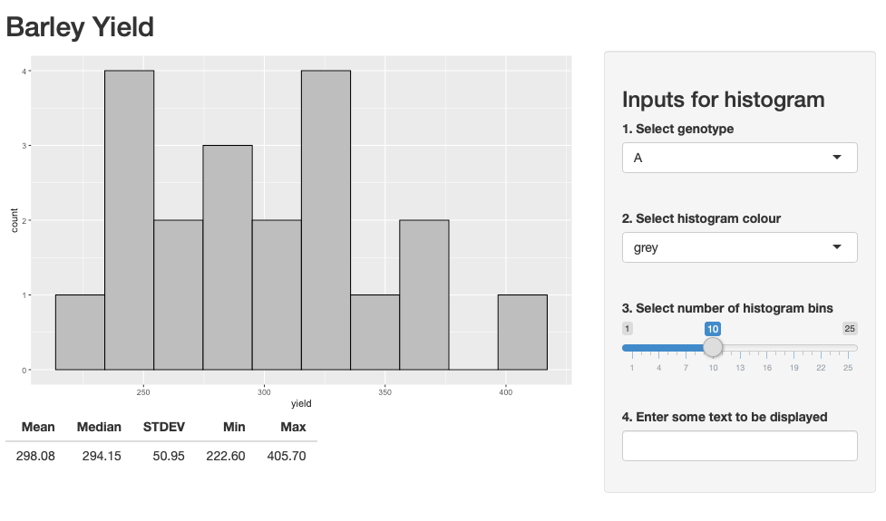
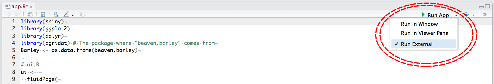
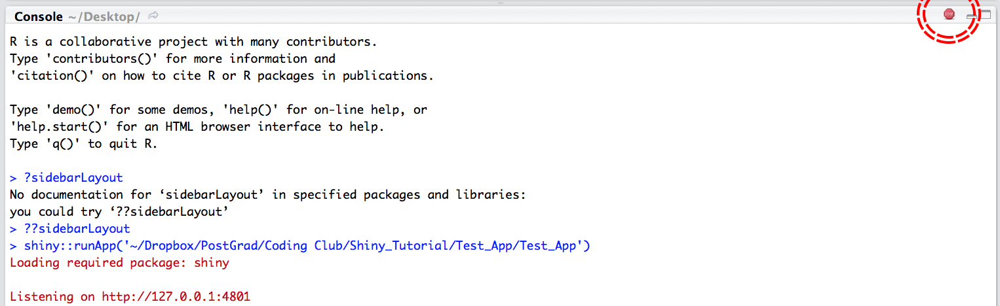

# R-Shiny

<a href="http://creativecommons.org/licenses/by-nc/4.0/" rel="license"></a>
This tutorial is licensed under a <a href="http://creativecommons.org/licenses/by-nc/4.0/" rel="license">Creative Commons Attribution-NonCommercial 4.0 International License</a>.

# Acknowledgements
This lab is based off of the Coding Club tutorial titled <a href="https://ourcodingclub.github.io/tutorials/shiny/#challenge"> "Getting Started with Shiny." </a>

# Lab Goals
1. Downloading Shiny
2. Getting familiar with the Shiny app file structure
3. Getting familiar with the Shiny app.R layout
4. Creating a Shiny app
5. Exporting a finished app
6. Challenge yourself to write an app

# Introduction
At it’s core, Shiny is merely an R package like dplyr or ggplot2. The package is used to create web-applications, but uses the R language rather than javascript or HTML5, which are traditionally used for web applications. By using R, Shiny provides an efficient method of creating web applications designed around data presentation and analysis.'

Below is an example of the basic Shiny app that we will be recreating in today’s tutorial:



Have a look at <a href="https://shiny.rstudio.com/gallery/">these examples</a> if you want to see what a Shiny app looks like, or if you want inspiration for your own app.

# What are Shiyn Apps useful for?
1. Interactive data visualisation for presentations and websites
2. Sharing results with collaborators
3. Communicating science in an accessible way
4. Bridging the gap between R users and non-R users

# Downloading Shiny and tutorial resources
To get Shiny in RStudio, the first thing you need is the shiny package, by running the code below in RStudio:

```R
install.packages("shiny")
install.packages("rsconnect")  # For publishing apps online
install.packages("agridat")  # For the dataset in today's tutorial
```

# The Shiny app file structure
Next, select "File/ New File/ Shiny Web App…," give the application a descriptive name (no spaces) and change the application type to “Single File (app.R)”, save the app in an appropriate directory and click "Create."

RStudio generates a template R script called app.R. Delete all the code in the template so you have a blank script.

Notice that the name you gave to your app was assigned to the directory, not the app script file. For your app to work, the file must remain named ```app.R```!

It is possible to create a Shiny app with two files called ```ui.R``` and ```server.R```, but the same can be accomplished by using one file. In the past, Shiny apps had to be created using two files, but the Shiny package has since been updated to allow the single file app structure, making things much tidier. You will see some tutorials on the internet using the old two file structure, but these can be easily translated to the one file structure. This tutorial will assume you have the one file app structure.

Now we can set up the rest of the folders for your app. Add a folder called ```Data``` and a folder called ```www``` in your app directory.```Data``` will hold any data used by the app and ```www``` will hold any images and other web elements.

To review, a Shiny application should have this specific folder structure to work properly:
```{r}
Test_App
├── app.R
├── Data
│   └── data.csv
└── www
    └── A.jpg
```
# app.R layout

Now that the folder structure is set up, head back to RStudio to start building app.R. A basic app.R consists of these five parts:

1. A section at the top of the script loading any packages needed for the app to run. shiny is required at the very least, but others like dplyr or ggplot2 could be added as they are needed:

```R
# Packages ----
library(shiny)  # Required to run any Shiny app
library(ggplot2)  # For creating pretty plots
library(dplyr)  # For filtering and manipulating data
library(agridat)  # The package where the data comes from
```
2. A section loading any data needed by the app:
```R
# Loading data ----
Barley <- as.data.frame(beaven.barley)
```
3. An object called ```ui```, which contains information about the layout of the app as it appears in your web browser. ```fluidPage()``` defines a layout that will resize according to the size of the browser window. All the app code will be placed within the brackets.
```R
# ui.R ----
ui <- fluidPage()
```
4. An object called ```server```, which contains information about the computation of the app, creating plots, tables, maps etc. using information provided by the user. All the app code will be placed within the curly brackets.
```R
# server.R ----
server <- function(input, output) {}
```
5. A command to run the app. This should be included at the very end of ```app.R```. It tells shiny that the user interface comes from the object called ```ui``` and that the server information (data, plots, tables, etc.) comes from the object called ```server```.
```R
# Run the app ----
shinyApp(ui = ui, server = server)
```
Delete any example code generated automatically when you created ```app.R``` and create a basic Shiny app by copying the snippets of code above into your ```
app.R```. Your script should now look like this:
```R
 # Packages ----
 library(shiny)  # Required to run any Shiny app
 library(ggplot2)  # For creating pretty plots
 library(dplyr)  # For filtering and manipulating data
 library(agridat)  # The package where the data comes from

 # Loading data ----
 Barley <- as.data.frame(beaven.barley)

 # ui.R ----
 ui <- fluidPage()

 # server.R ----
 server <- function(input, output) {}

 # Run the app ----
 shinyApp(ui = ui, server = server)
```
# Creating a Shiny App - Basic Syntax
To illustrate how to code a Shiny app, we will recreate a simple app written by <a href="https://github.com/gndaskalova">Gergana Daskalova</a> to explore some data on the productivity of Barley genotypes.

Look at the new code below and compare what you have in your current RStudio environment (don't copy and past just yet!!!):
```R
# Packages ----
library(shiny)  # Required to run any Shiny app
library(ggplot2)  # For creating pretty plots
library(dplyr)  # For filtering and manipulating data
library(agridat)  # The package where the data comes from

# Loading data ----
Barley <- as.data.frame(beaven.barley)

# ui.R ----
ui <- fluidPage(
  titlePanel(""),  # Add a title panel
  sidebarLayout(  # Make the layout a sidebarLayout
    sidebarPanel(),  # Inside the sidebarLayout, add a sidebarPanel
    mainPanel()  # Inside the sidebarLayout, add a mainPanel
  )
)

# server.R ----
server <- function(input, output) {}

# Run the app ----
shinyApp(ui = ui, server = server)
```
What did you notice? We can see that the app has a ```sidebarLayout``` with a ```sidebarPanel```, ```mainPanel``` and ```titlePanel```. It uses a ```selectInput``` to choose the genotype of barley shown in the histogram and the table, another ```selectInput``` for the colour of the histogram, a ```sliderInput``` to choose the number of bins in the histogram and a ```textInput``` to display some text in the app. The histogram is located in the ```mainPanel``` along with a summary table of the data being shown, while the inputs are in the ```sidebarPanel```.

Now, go back to your ```app.R``` and fill in the code you already have with the new bits of code below, which will serve as the basic skeleton for our app. Remember that you should only have one ```ui``` and one ```server``` object. 

```titlePanel()``` indicates that we would like a separate panel at the top of the page in which we can put the title.

```sidebarLayout()``` indicates that we want our Shiny app to have the sidebar layout, one of many layouts we saw above. Within sidebarLayout we have:

```sidebarPanel()``` indicates that we want a sidebar panel included in our app. Sidebar panels often contain input widgets like sliders, text input boxes, radio buttons etc.

```mainPanel()``` indicates that we want a larger main panel. Main panels often contain the output of the app, whether it is a table, map, plot or something else.

# Input Widgets
Now that we have our basic structure we can start to fill it with inputs and outputs.

The example app has four input widgets, a ```selectInput``` for genotype, a ```selectInput``` for histogram colour, a ```sliderInput``` for number of bins and a ```textInput``` to add some arbitrary text. Each of these widgets provides information on how to display the histogram and its accompanying table. In the example app, all the widgets are found in the ```sidebarPanel``` so the code for these widgets should be put in the ```sidebarPanel``` command like this:

```R
ui <- fluidPage(
  titlePanel("Barley Yield"),
  sidebarLayout(
    sidebarPanel(
      selectInput(inputId = "gen",  # Give the input a name "genotype"
      label = "1. Select genotype",  # Give the input a label to be displayed in the app
      choices = c("A" = "a","B" = "b","C" = "c","D" = "d","E" = "e","F" = "f","G" = "g","H" = "h"), selected = "a"),  # Create the choices that can be selected. e.g. Display "A" and link to value "a"
    selectInput(inputId = "col", 
      label = "2. Select histogram colour", 
      choices = c("blue","green","red","purple","grey"), selected = "grey"),
    sliderInput(inputId = "bin", 
      label = "3. Select number of histogram bins", 
      min=1, max=25, value= c(10)),
    textInput(inputId = "text", 
      label = "4. Enter some text to be displayed", "")
    ),
  mainPanel()
  )
)
```
Note that ```choices = c("A" = "a" ...``` could be replaced with ```choices = unique(Barley$gen)``` to simply use the groups directly from the dataset.

<strong>Spend a couple of minutes looking at this code so you understand what it means, then fill in your own ```app.R``` with the code.</strong>

Let’s break down ```selectInput()``` to understand what is going on:

1. ```inputId = "genotype"``` gives this input the name ```genotype```, which will become useful when referencing this input later in the app script.
2. ```label = "1\. Select genotype"``` gives this input a label to be displayed above it in the app.
3. ```choices = c("A" = "a","B" = "b", ...``` gives a list of choices to be displayed in the dropdown menu (```A, B, etc.```) and the value that is actually gathered from that choice for use in the output (```a, b, etc.```).
4. ```selected = "grey"``` gives the value from the dropdown menu that is selected by default.

You can look into the arguments presented by the other input widgets by using the help function ```?```. For example, by running the code ```?textInput``` in the R console.

# More Input Widgets
```R
actionButton(inputId = "action", label = "Go!")
```
```R
radioButtons(inputId = "radio", label = "Radio Buttons", choices = c("A", "B"))
```
```R
selectInput(inputId = "select", label = "select", choices = c("A", "B"))
```
```R
sliderInput(inputId = "slider", label = "slider", value = 5, min = 1, max = 100)
```
Notice how all of the inputs require an ```inputId``` and a ```label``` argument.

# Running a Shiny App
Take this opportunity to preview your app by clicking "Run App":


or use the keyboard shortcut ```Cmd + Opt + R``` (Mac), ```Ctrl + Alt + R``` (Windows).

When a Shiny app is running from RStudio, the console cannot be used. To stop the app, click the "Stop" button in the top right of the console window or press the ```Esc``` key.



# Output
A Shiny app without any outputs is useless. Outputs can be in the form of plots, tables, maps or text.

As per our example app, we’re going to be using ggplot() to create a histogram.

Outputs are created by placing code in the curly brackets (```{}```) in the ```server``` object:

```R
server <- function(input, output) {
  output$plot <- renderPlot(ggplot(Barley, aes(x = yield)) +  # Create object called `output$plot` with a ggplot inside it
  geom_histogram(bins = 7,  # Add a histogram to the plot
    fill = "grey",  # Make the fill colour grey
    data = Barley,  # Use data from `Barley`
    colour = "black")  # Outline the bins in black
  )                                                       
}
```
<strong>Look at the code above for a couple of minutes to understand what is going on, then add it to your own app.R in the appropriate place.</strong>

Basically, we are creating an object called ```output$plot``` and using ```renderPlot()``` to wrap a ```ggplot()``` command.

# Reactive output
The histogram is great, but not particularly interactive. We need to link our input widgets to our output object.

We want to select individual genotypes to display in our histogram, which the user can select using the ```selectInput``` that we called ```genotype``` earlier. Use some base R wizardry, ```[]``` ```$``` and ```==```, to select the data we want. <strong>Update ```server``` with the new reactive output arguments so it looks like the code below:</strong>
```R
server <- function(input, output) {
  output$plot <- renderPlot(ggplot(Barley, aes(x = yield)) +
  geom_histogram(bins = 7,
      fill = "grey",
      data = Barley[Barley$gen == input$gen,],
      colour = "black")
  )                                                       
}
```
```data = Barley[Barley$Genotype == input$gen,]``` tells ```geom_histogram()``` to only use data where the value in column ```gen``` is equal to (```==```) the value given by ```input$gen```. Note the ```,``` after ```input$gen``` which indicates that we are selecting columns and that all the rows should be selected.

Next, we want to be able to change the colour of the histogram based on the value of the ```selectInput``` called ```colour```. To do this, simply change fill = “grey” to ```fill = input$colour```.

Next, we want to select the number of bins in the histogram using the ```sliderInput``` called ```bin```. Simply change ```bins = 7``` to ```bins = input$bin```.

Finally, to create a table output showing some summary statistics of the selected genotype, create a new output object called ```output$table``` and use ```renderTable()``` to create a table generated using dplyr ```summarise()```. Notice that the ```summarise()``` function from the dplyr is being used; remember using this in a prior lesson/lab? <strong>Update server with the ```output$table``` information so it looks like the code below:</strong>
```R
server <- function(input, output) {
output$myhist <- renderPlot(ggplot(Barley, aes(x = yield)) + 
	geom_histogram(bins = input$bin, fill = input$col, group=input$gen, 
		data=Barley[Barley$gen == input$gen,],
  		colour = "black"))

output$mytext <- renderText(input$text)

output$mytable <- renderTable(Barley %>%
filter(gen == input$gen) %>%
summarise("Mean" = mean(yield), 
  	"Median" = median(yield),
  	"STDEV" = sd(yield), 
  	"Min" = min(yield),
  	"Max" = max(yield)))
}
```
# Displaying output
To make the outputs appear on your app in the ```mainPanel```, <strong>they need to be added to the ```ui``` object inside ```mainPanel()``` like so:</strong>
```R
ui <- 
  fluidPage(
    titlePanel("Barley Yield"),
    sidebarLayout(
      position = "right",
      sidebarPanel(h3("Inputs for histogram"), 
                   selectInput("gen", "1. Select genotype", choices = c("A" = "a","B" = "b","C" = "c","D" = "d","E" = "e","F" = "f","G" = "g","H" = "h"), selected = "a"),
                   br(),
                   selectInput("col", "2. Select histogram colour", choices = c("blue","green","red","purple","grey"), selected = "grey"),
                   br(),
                   sliderInput("bin", "3. Select number of histogram bins", min=1, max=25, value= c(10)),
                   br(),
                   textInput("text", "4. Enter some text to be displayed", "")),
                   mainPanel(
                             plotOutput("myhist"),
                             tableOutput("mytable"),
                             textOutput("mytext")
                             )
      )
    )
```
 
